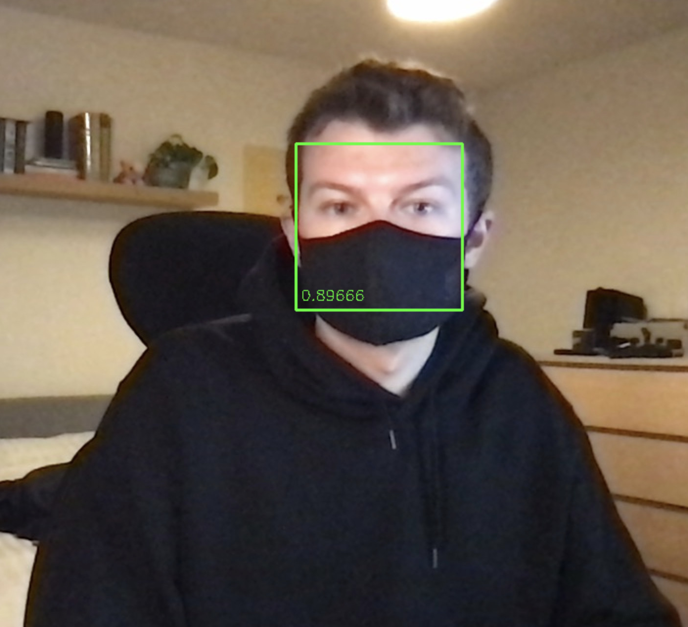

# Face Mask Detection Project

CNN Project for face mask detection in images.

**Status**: Ongoing

## Setup

### 1. System Requirements
1. Install Python 3.8
2. Install virtualenvwrapper

### 2. Clone the GitHub repository
REQUIREMENTS: git, GitHub connection with SSH

1. Clone repository:

    ```bash
    $ git clone git@github.com:nickhill97/face-mask-detection.git
    ```

### 3. Set up virtual environment

1. Create a new virtual environement using Python 3.8:

    ```bash
    $ mkvirtualenv face-mask-detection --python=<path to python 3.8>
    ```

2. Set the project for the virtual environement:

    ```bash
    $ workon face-mask-detection
    $ cd <path to project>
    $ setvirtualenvproject
    ```

3. Install the Python requirements:

    ```bash
    $ pip install -r requirements.txt
    ```

### 4. Download data, train CNN

**NB**: My intention is to store different models in the models directory so that infer.py can be used immediately to make predictions on images but I need to figure out a method of storing the models that complies to GitHub's size restrictions.

If you are wanting to train the CNN to create the model yourself, this can be done with the following:

1. Use the bash script to download the image files

    ```bash
    $ bash get_data.sh
    ```

2. Create dataframes of the image info

    ```bash
    $ python create_dataframes.py
    ```

3. Preprocess the images for model

    ```bash
    $ python preprocessing.py
    ```

4. Train model

    ```bash
    $ python train_cnn.py
    ```
    
    This will save the model in the models directory so that it can be used with the infer.py script.
    
### 5. Make predictions on an image

1. To make predictions on an image run the following

    ```bash
    $ python infer.py path/to/model path/to/image
    ```

Example:


    
The model is two part:

- Firstly, it uses the PyPi package face-detection to find the faces in the image.
- Then it uses the trained CNN to predict if the person is wearing a face mask.

There are some limitations to this approach. As the purpose of a face mask is to cover the face, if it obscures the features of a face too much then the face-detection package struggles to find the faces in the image and therefore there is nothing for the CNN to predict on.

This could be improved by training a CNN to find faces and faces wearing face mask in an object detection approach.
